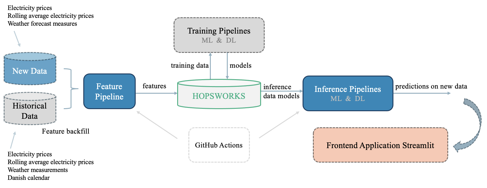

# **Msc. BDS - M7 Second Semester Project** 
 EXAM ASSIGNMENT - Repository for semester project

## Expectations and Format for the Semester Project:
The semester project represents the first significant milestone in applying the knowledge and skills acquired from the curriculum. It's designed to bridge the gap between theoretical understanding and real-world application.

Format should include:
- Functional ML pipeline suited for the project.
- One or multiple GitHub repositories demonstrating the code for each segment in the pipeline.
- Project report. The report is a (semi/non) technical documentation.
- Topic can be any real-world problem. 
- A functional frontend application.

## Objectives:
This repository contains all notebooks and local data files for the final second-semester project on the Master in Business Data Science at Aalborg University Business School.

This project aims to build a prediction system that forecasts the electricity prices in Denmark (area DK1) based on weather conditions, previous prices, and the Danish calendar.

## Structure:
There are five notebooks in the folder "*notebooks*":

1. **Feature Backfill**: Historical data is loaded and we engineer and create feature groups in Hopswork. Exploratory Data Analysis is performed aimed at understanding the characteristics and underlying patterns within the data.
2. **Feature Pipeline**: New data are parsed and inserted into the feature groups.
3. **Training Pipeline XGBRegressor**: Building feature view, feature engineering for time-series data, training dataset split, training the model, and saving it in the Model Registry.
4. **Training Pipeline LSTM**: Building feature view, model architecture, and training dataset split, training the model, and saving it in the Model Registry.
5. **Inference Pipeline**: One of the trained models is selected for final predictions. The trained model is retrieved from the model registry and used for inference and electricity price predictions on weather forecast measures.

The structure of the notebooks is largely inspired by [Hopsworks tutorials](https://github.com/logicalclocks/hopsworks-tutorials).
Inspiration for code snippets has been taken from the following advanced tutorials [air_quality](https://github.com/logicalclocks/hopsworks-tutorials/tree/master/advanced_tutorials/air_quality), [electricity](https://github.com/logicalclocks/hopsworks-tutorials/tree/master/advanced_tutorials/electricity), and [timeseries](https://github.com/logicalclocks/hopsworks-tutorials/tree/master/advanced_tutorials/timeseries).

[Hopsworks](https://www.hopsworks.ai) is used as the platform to store features in the **Hopworks Feature Store** and save the trained models in **Hopworks Model Registry**. Daily instance generation is done through Github Actions. Feature pipeline and inference are scheduled to run at 01:55 UTC everyday and then scheduled to sync to Huggingface Spaces at 02:01 UTC everyday.

## Data Pipeline:
The overall architecture of the Electricity Pipeline is illustrated below. Inspiration is taken from [Lecture 1 - serverless ml course feature pipelines](https://drive.google.com/file/d/1L8DHGC5xo0NlNe8xfh4xf4NZV1CEGBA6/view). 

## Data:
The data used comes from the following sources:

- Hourly electricity prices in Denmark per day from [Energinet/Energidataservice](https://www.energidataservice.dk).
- Different meteorological observations based on Aalborg Denmark from [Open Meteo](https://www.open-meteo.com).
- Weather Forecast based on Aalborg Denmark also from [Open Meteo](https://www.open-meteo.com).
- Danish calendar that categorizes dates into types based on whether it is a workday or not. The Calendar is imported from the Python Danish holiday library.

See corresponding functions in the folder [features](https://github.com/Camillahannesbo/MLOPs-Assignment-/tree/main/features). The functions include the initial API call and the following data preprocessing.

## Model Performance Comparison:
We initialize XGBoost Regressor and Long-Short-Term Memory as the models used for training, separated into separate pipelines. 
The models are fitted to the train data and further evaluated on test sets using validation metric functions from the sklearn library. Actual and predicted prices are displayed for translating the models' performances from technical to non-technical audiences. 

### XGB Regressor 
| Validation metrics   | Value    |  
|----------------------|----------|
| MSE                  | 0.059    |
| R^2                  | 0.933    |
| MAE                  | 0.166    |

| Actual Prices  | Predicted Prices |  
|----------------|------------------|
| ...            | ...              |
| ...            | ...              |
| ...            | ...              |

### LSTM
| Validation metrics   | Value    |  
|----------------------|----------|
| MSE                  | 0....    |
| R^2                  | 0....    |
| MAE                  | 0....    |

| Actual Prices  | Predicted Prices |  
|----------------|------------------|
| ...            | ...              |
| ...            | ...              |
| ...            | ...              |

## Frontend Application on 🤗 Hugging Face Spaces:
We have made a functional frontend application that visually demonstrates the project’s application in real-world scenarios. The Streamlit application is located in the following [Github Repository](https://github.com/tobiasmj97/bds_m7_second-semester-project_streamlit).

Streamlit app is hosted on [Huggingface](https://huggingface.co/spaces/Camillahannesbo/Electricity_price).
